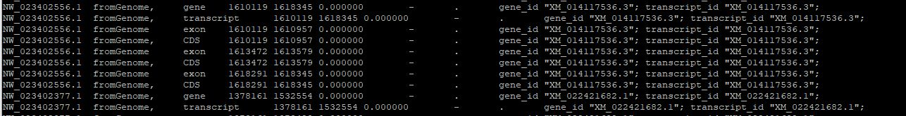

# MapAnnotations

When working on a non-model organism, there are many ways by which to identify the location of coding sequences in a de novo genome assembly. These range from the purely theoretical approaches to the more practical method of mapping RNA sequences to the assembly and then using the mapped reads to identify the location of the transcripts' exons. However, once the coding sequences have been deduced, it can be very difficult to identify what genes they are and give them a function, enabling you to link them to KEGG pathways or Gene Ontology phrases. 

Fortunately, the number of well-annotated genomes is increasing through the efforts of large genome centres such as the NCBI. These can be used as the starting point for the annotation of a related species. For example, the dog (Canis lupus familiaris) is a reasonably well studied species and so could be used to infer the annotation of a poorly studied animal such as the evolutionarily related grey seal (Halichoerus grypus). 

To do this, we must first get the dog's reference genome and the linked GTF annotation file. These can easily be obtained from the Genome Browser's [Genome Data page](https://hgdownload.soe.ucsc.edu/downloads.html?_gl=1*11ug8p7*_ga*MTMzMDM3MzY1Ny4xNjMyOTIwNTkx*_ga_P5EV0BL192*MTcxOTQzOTk2Mi4yNy4wLjE3MTk0Mzk5NjIuMC4wLjA.) > [Canine data](https://hgdownload.soe.ucsc.edu/goldenPath/canFam6/bigZips/) and [Table Browser](https://genome.ucsc.edu/cgi-bin/hgTables) web pages by selecting the required data files and format (Figure 1).

Figure 1: Obtaining the annotation file. 

First select the select the whole genome (pink box) for the correct reference file and gene set (blue box). Then select the correct data format (red box) and enter the file's name and gzip compression (green box) before pressing the ***get output*** button (black box). 

Once downloaded move the genome (fa.gz) and annotation (gtf.gz) files to a Linux server (only the mapping step has to be performed on a Linux machine) - leave the files as gzip compressed files. Next use the [p_getSequencesFromGTFAndFasta.py](scripts/p_getSequencesFromGTFAndFasta.py) to identify the Dog's transcript sequences in the it's reference genome as annotated in the gtf file, saving them to a fasta file using a command similar to this:

> python p_getSequencesFromGTFAndFasta.py canFam6.fa.gz canFam6.gtf.gz canFam6mRNA.fa

***Description*** 

|Parameter|Purpose|
|-|-|
|python|Indicates the script is a python script|
|p_getSequencesFromGTFAndFasta.py|The name of the script file|
|canFam6.fa.gz|Name of the reference genome|
|canFam6.gtf.gz|Name of the gtf annotation file|
|canFam6_mRNA.fa|Name of the file to save the transcript sequences too|

***Note***: You may need to include the location of the files as well as their names.

When the __p_getSequencesFromGTFAndFasta.py__ runs, it first reads the gtf file and collects the positions of the exons in each transcript (Figure 2a). It then reads the reference fasta files one chromosome/contig at a time and identifies the sequences for each exon in that chromosome/contig, saving them to the export file (Figure 2b). Each transcript's sequence is saved in the fasta file using the transcript's ID value as an identifier. If the transcript is on the forward strand is as a __+__ appended to the name, while a __-__ indicates its on the reverse strand. 

Figure 2a: Collecting the locations of the exons in the gtf file

Figure 2b: Reading the reference fasta file and saving the mRNA/cDNA sequences to file

Figure 2c: Transcript sequence in the exported file

Once the transcript sequence fasta file has been created, align these sequences to the non-model organism's genome reference sequence using [minimap2](https://github.com/lh3/minimap2). minimap2 is a long read sequence aligner that is designed to map genomic or RNA long read data from a PacBio or ONT sequencer to a genome. Since, ONT long read data can be very noisy, the fact that the transcript sequences may be have evolutionarily diverged from genome should not be a massive issue if the two species aren't to distant from each other. 

The command below uses minimap2 to both make an index for the genome reference and then map the sequences to this index all in one step.  

> minimap2 -ax splice -t 8 grey_seal_a.fna canFam6mRNA.fa \> GreySealCanine6.sam

|Parameter|Purpose|
|-|-|
|minimap2|name of program to run|
|-ax|Instructs minimap2 to first create an index and the align the transcripts to it|
|splice|Indicates that the sequences to be aligned have been spliced and so the alignment may not be contiguous. Since 'splice' is used with no suffix, it indicates the data is expected to be noisy like ONT data as opposed to PacBio data|
|-t 8|Instructs minimap2 to use 8 processors|
|grey_seal_a.fna|Name of the file containing the reference sequence to align data too|
|canFam6mRNA.fa|Name of the transcripts to be aligned to the genome|
|GreySealCanine6.sam|Name of file to save the aligned data too|

***Note***: You may need to include the location of the files as well as their names.

Once the dog's transcripts have been aligned, use the [p_SAMPacBioToGTF.py](scripts/p_SAMPacBioToGTF.py) to extract the regions of homology between the dog's transcripts and the grey seal genome using a command similar to:

> python p_SAMPacBioToGTF.py grey_seal.sam grey_seal.gtf 60

|Parameter|Purpose|
|-|-|
|python|Indicates the script is a python script|
|p_SAMPacBioToGTF.py|The name of the script file|
|grey_seal.sam|Name of the alignment file created by minimap2|
|grey_seal.gtf|Name of the gtf file created by p_SAMPacBioToGTF.py that contains the exons for each transcript|
|60|This filters the alignments based on how many indels are in the alignment that are not caused by the lack of introns in the transcript sequences. While some small insertions and deletions are to be expected, a large number suggests that the alignment is wrong or for example is aligned to a pseudo gene. This number needs to be modified depending on how distant the two species are. The more divergent the bigger the number.|

***Note***: You may need to include the location of the files as well as their names.

p_SAMPacBioToGTF.py also creates a 2nd file called grey_seal.gtf.txt that contains all the alignments rejected by p_SAMPacBioToGTF.py either because it has to many indels or it was not mapped at all.

As p_SAMPacBioToGTF.py runs it indicates the number of exons identified and the number of alignments rejected (Figure 3a and 3b).

Figure 3a: Feed back while the script is running

Figure 3b: The number of exons and ignored alignments at the end of an analysis

The exported gtf file has the standard gtf format with the features of gene, transcript, exon and CDS shown which include the transcript ID and gene ID given in the metadata (Figure 4). The sam file indicates whether the aligned sequence was aligned to the reference sequence's forward or reverse strand. Similarly, the data in the transcript mRNA fasta file indicates whether the sequences was present on the model organism's forward or reverse strand. This information is then used to determine if the gene is on the reference sequences forward ot reverse strand as indicated in the table below Figure 4.

Figure 4

|Status|On model organism's forward strand (+)|On model organism's reverse strand (-)|
|-|-|-|
|Aligned to forward strand (+)|Gene on forward strand (+)| Gene on reverse strand (-)|
|Aligned to reverse strand (-)|Gene on reverse strand (-)|Gene on forward strand (+)|
